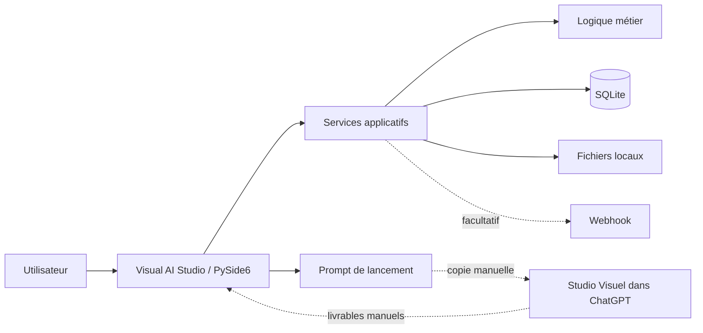

# Architecture

## Baseline

Visual AI Studio **0.1.1** est une application Windows locale en Python / PySide6.

- Interface : PySide6
- Logique métier : Python
- Données : SQLite local
- Fichiers : stockage local choisi par l'utilisateur
- Agent créatif : Studio Visuel dans ChatGPT
- Intégration externe : webhook facultatif

## Vue simple

Visual AI Studio ne réalise aucun appel direct à une API OpenAI. Le passage vers Studio Visuel et le retour des livrables restent manuels.

## Organisation

- `src/visual_ai_studio/domain` : règles métier ;
- `src/visual_ai_studio/services` : cas d'usage ;
- `src/visual_ai_studio/infrastructure` : persistance et intégrations ;
- `src/visual_ai_studio/ui` : interface graphique ;
- `src/visual_ai_studio/resources` : ressources embarquées ;
- `migrations` : migrations SQLite ;
- `agent` : package Studio Visuel ;
- `installer` : configuration Inno Setup ;
- `scripts` : tests, qualité, build et packaging ;
- `.github/workflows` : automatisation de la release Windows.

## Distribution

La distribution Windows est produite avec PyInstaller puis Inno Setup. Les artefacts officiels sont publiés dans GitHub Releases avec leurs empreintes SHA-256.
