<p align="center">
  
</p>

<h1 align="center">Visual AI Studio</h1>

<p align="center">
  Studio Windows local pour structurer un brief, travailler avec Studio Visuel,
  contrôler les créations et exporter les livrables.
</p>

---

## À quoi sert Visual AI Studio ?

Visual AI Studio accompagne un projet visuel du brief jusqu'à l'export final, avec Instagram comme canal de publication principal.

L'application reste volontairement simple :

1. vous préparez le brief dans Visual AI Studio ;
2. vous choisissez de 1 à 10 visuels principaux pour la publication ;
3. l'application génère un prompt de lancement ;
4. vous copiez ce prompt dans Studio Visuel ;
5. Studio Visuel prépare puis génère exactement le nombre de visuels demandé ;
6. le Skill IA-Art signe les images et prépare les livrables ;
7. vous récupérez les fichiers générés ;
8. Visual AI Studio les contrôle et les présente ;
9. vous validez puis exportez le résultat.

Visual AI Studio ne réalise **aucun appel direct à une API OpenAI** et ne nécessite aucune clé API OpenAI.

---

## Deux composants, deux rôles

### Visual AI Studio

L'application Windows prend en charge :

- les projets ;
- les briefs ;
- la préparation du prompt de lancement ;
- l'import des résultats ;
- la galerie de validation ;
- la validation humaine ;
- l'export local.

### Studio Visuel

Studio Visuel est l'agent conversationnel utilisé dans ChatGPT.

Il prend en charge notamment :

- la reformulation du brief ;
- la direction artistique ;
- le mini-storyboard multi-images ;
- les prompts image ;
- les contraintes négatives ;
- les contenus de publication ;
- la génération de exactement N visuels pour un seul post Instagram ;
- le passage au Skill IA-Art pour signature et packaging.

Le package est fourni dans :

`agent/studio-visuel-agent.zip`

Il contient la définition de Studio Visuel, le Skill IA-Art Instagram et la licence MIT.

---

## Workflow

```mermaid
flowchart LR
    A[Brief créatif] --> B[Préparation Studio Visuel]
    B --> C[Copier le prompt]
    C --> D[Studio Visuel dans ChatGPT]
    D --> E[Direction artistique + storyboard]
    E --> F[Génération de N visuels Instagram]
    F --> G[IA-Art : signature + paquet]
    G --> H[Importer les fichiers]
    H --> I[Validation humaine]
    I --> J[Export local]
```



Le passage entre l'application et Studio Visuel reste manuel.

---

## 1. Les projets

La page **Projets** constitue le point d'entrée de l'application.

Trois statuts métier sont utilisés :

- **Brief**
- **Validé**
- **Archivé**

---

## 2. Créer un brief

La page **Créer** permet de structurer la demande visuelle avant de passer dans Studio Visuel.

Deux modes de sortie sont disponibles :

- **Instagram** — mode par défaut, 1080 × 1350, ratio 4:5 ;
- **Autre / personnalisé**.

Pour Instagram, un post peut contenir **1 à 10 visuels principaux cohérents**.

La fiche synthèse et le Markdown IA-Art restent des livrables annexes séparés et ne comptent pas dans le nombre de visuels.

Le brief peut notamment préciser :

- le nom du projet ;
- la collection ou campagne ;
- l'idée ou la demande ;
- l'audience ;
- le style ;
- le nombre de visuels ;
- le texte souhaité dans l'image ;
- les dimensions ;
- le ratio ;
- les contraintes créatives ;
- les éléments obligatoires ;
- les éléments interdits.

Une fois le brief prêt, utilisez **Préparer pour Studio Visuel**.

---

## 3. Studio Visuel et IA-Art

Visual AI Studio transmet le contexte du projet et le nombre de visuels principaux attendu.

Studio Visuel doit produire exactement ce nombre de visuels pour un seul post Instagram. Pour une série multi-images, il prépare une direction artistique commune et un mini-storyboard numéroté.

Le Skill IA-Art embarqué dans `agent/studio-visuel-agent.zip` prend ensuite en charge :

- la signature officielle de chaque image ;
- une fiche synthèse unique pour le post ;
- un Markdown Notion unique ;
- une archive unique contenant l'ensemble des livrables.

---

## 4. Importer et contrôler les résultats

Visual AI Studio accepte notamment :

### Images

- PNG
- JPG / JPEG
- WebP

### Fichiers complémentaires

- Markdown
- TXT
- JSON

Les images sont présentées sous forme de galerie afin de contrôler plusieurs créations dans un même projet.

La validation finale reste volontairement humaine : **Je valide ce résultat**.

---

## 5. Exporter

Lorsqu'un résultat est validé, le projet peut être exporté localement.

Les données de travail restent locales sur l'ordinateur.

---

## Télécharger

La version Windows publique actuelle est **v0.1.1**.

➡️ [Accéder à la dernière GitHub Release](https://github.com/Etorrent-Org/visual-ai-studio/releases/latest)

---

## Installation Windows

Visual AI Studio est distribué sous forme d'application Windows autonome.

L'utilisateur final n'a pas besoin d'installer Python, Git ou Docker.

---

## Développement

```powershell
git clone https://github.com/Etorrent-Org/visual-ai-studio.git
cd visual-ai-studio
py -3.11 -m venv .venv
.\.venv\Scripts\python.exe -m pip install -e ".[dev]"
.\.venv\Scripts\python.exe -m visual_ai_studio.main
.\.venv\Scripts\python.exe -m pytest -q
```

---

## Sécurité et confidentialité

Visual AI Studio ne nécessite aucune clé API OpenAI. Les données restent locales sauf action volontaire de l'utilisateur en dehors de l'application.

Consultez [`SECURITY.md`](SECURITY.md) pour les règles de sécurité.

---

## Licence

Visual AI Studio est distribué sous **licence MIT**. Consultez [`LICENSE`](LICENSE).

---

## Version

Version publique actuelle : **0.1.1**.
