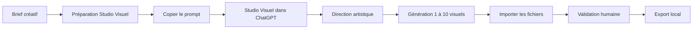

<p align="center">
  
</p>

<h1 align="center">Visual AI Studio</h1>

<p align="center">
  Studio Windows local pour structurer un brief, travailler avec Studio Visuel,
  contrôler les créations et exporter les livrables.
</p>

---

## À quoi sert Visual AI Studio ?

Visual AI Studio accompagne un projet visuel du brief jusqu'à l'export final, avec Instagram comme canal de publication principal.

L'application reste volontairement simple :

1. préparer le brief dans Visual AI Studio ;
2. choisir de 1 à 10 visuels principaux pour la publication ;
3. générer le prompt de lancement ;
4. copier ce prompt dans Studio Visuel ;
5. récupérer les fichiers générés ;
6. les contrôler dans Visual AI Studio ;
7. valider puis exporter le résultat.

Visual AI Studio ne réalise **aucun appel direct à une API OpenAI** et ne nécessite aucune clé API OpenAI.

## Deux composants, deux rôles

### Visual AI Studio

L'application Windows prend en charge les projets, briefs, prompts de lancement, imports, galerie de validation, validation humaine et export local.

### Studio Visuel

Studio Visuel est l'agent conversationnel utilisé dans ChatGPT. Il prend en charge la reformulation du brief, la direction artistique, le prompt image, les contraintes négatives, les contenus de publication, la génération visuelle et la livraison des résultats.

Le Skill `visual-content-studio` constitue la source de vérité fonctionnelle de l'agent. Son package est fourni dans `agent/studio-visuel-agent.zip`.

## Workflow



Le passage entre l'application et Studio Visuel reste manuel afin de ne pas imposer d'API et de conserver une validation humaine.

## Créer un brief

La page **Créer** propose deux modes de sortie :

- **Instagram** — mode par défaut, 1080 × 1350 px, ratio 4:5 ;
- **Autre / personnalisé** — dimensions et ratio libres.

Pour Instagram, un post peut contenir **1 à 10 visuels principaux cohérents**. Ce nombre concerne uniquement les images destinées à la publication : la fiche synthèse et le Markdown IA-Art restent des livrables annexes séparés.

Le brief peut notamment préciser le nom du projet, la collection ou campagne, l'idée, l'audience, le style, le nombre de visuels, le texte dans l'image, les dimensions, le ratio et les contraintes créatives.

Une fois le brief prêt, utilisez **Préparer pour Studio Visuel**.

## Importer et contrôler les résultats

Visual AI Studio accepte notamment les images PNG, JPG/JPEG et WebP ainsi que les fichiers complémentaires Markdown, TXT et JSON.

Les images sont présentées sous forme de galerie afin de contrôler une publication comportant plusieurs visuels. Les avertissements sont affichés avant la validation finale humaine : **Je valide ce résultat**.

## Exporter

Lorsqu'un résultat est validé, le projet peut être exporté localement. Visual AI Studio crée un dossier dédié contenant les livrables disponibles.

## Paramètres et stockage

Visual AI Studio suit une approche **local-first**. Les projets, la base de données et les fichiers de travail restent stockés localement. Le dossier des projets est configurable dans **Paramètres → Stockage local → Dossier des projets**.

## Télécharger

La version Windows publique actuelle est **v0.1.1**.

➡️ [Accéder à la dernière GitHub Release](https://github.com/Etorrent-Org/visual-ai-studio/releases/latest)

La Release contient l'installateur Windows, le package Studio Visuel et les empreintes SHA-256.

## Installation Windows

Visual AI Studio est distribué sous forme d'application Windows autonome. L'utilisateur final n'a pas besoin d'installer Python, Git ou Docker.

## Installer Studio Visuel

Le package de l'agent se trouve dans `agent/studio-visuel-agent.zip`. Une documentation complémentaire est disponible dans [`agent/README.md`](agent/README.md).

## Architecture technique

L'application repose notamment sur Python 3.11+, PySide6, Pydantic, SQLAlchemy, SQLite, Pillow, platformdirs, keyring, PyInstaller et Inno Setup.

## Développement

```powershell
git clone https://github.com/Etorrent-Org/visual-ai-studio.git
cd visual-ai-studio
py -3.11 -m venv .venv
.\.venv\Scripts\python.exe -m pip install -e ".[dev]"
.\.venv\Scripts\python.exe -m visual_ai_studio.main
.\.venv\Scripts\python.exe -m pytest -q
```

## Sécurité et confidentialité

Visual AI Studio ne nécessite aucune clé API OpenAI. Les données restent locales sauf action volontaire de l'utilisateur en dehors de l'application. Consultez [`SECURITY.md`](SECURITY.md) pour les règles de sécurité.

## Licence

Visual AI Studio est distribué sous **licence MIT**. Consultez [`LICENSE`](LICENSE).

## Version

Version publique actuelle : **0.1.1**.
