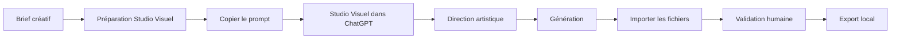
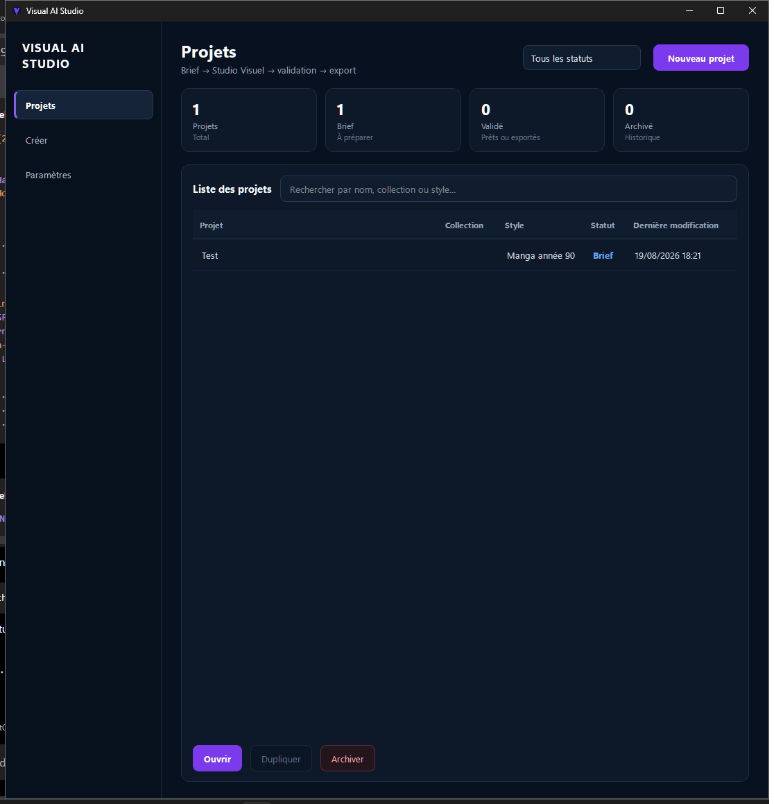
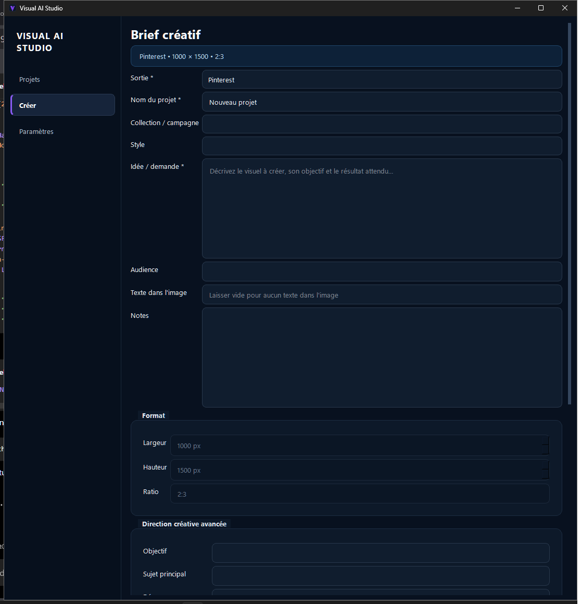
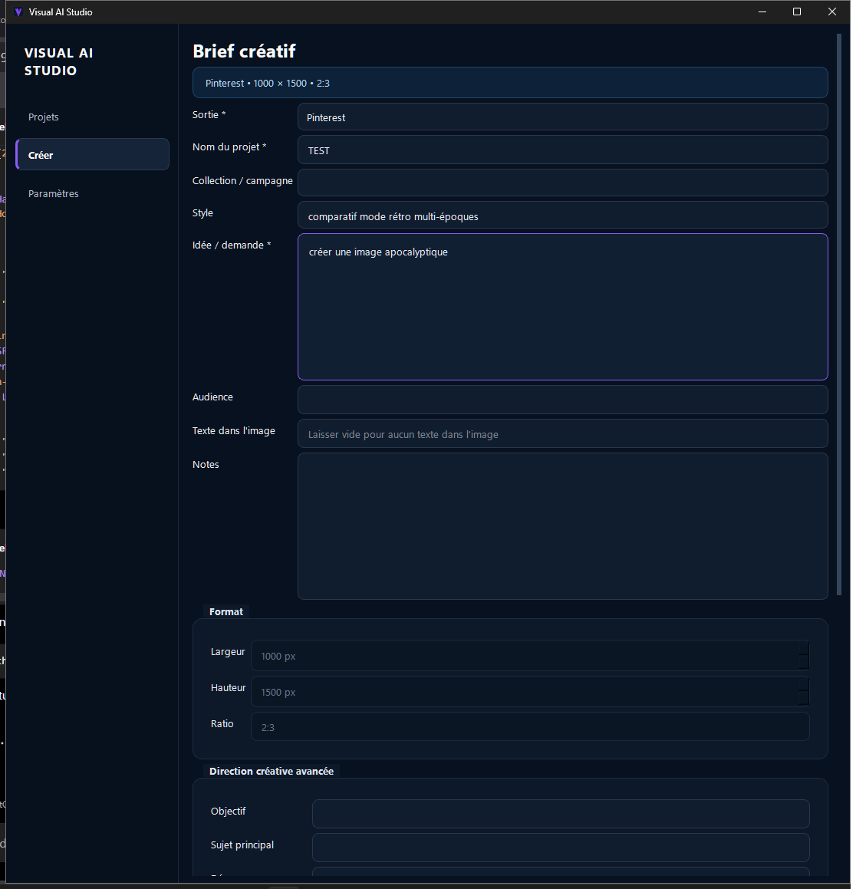
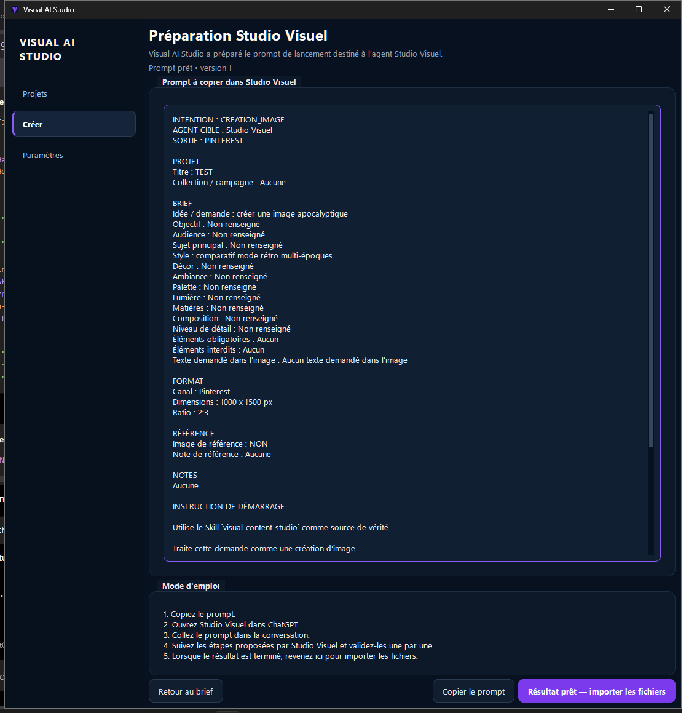
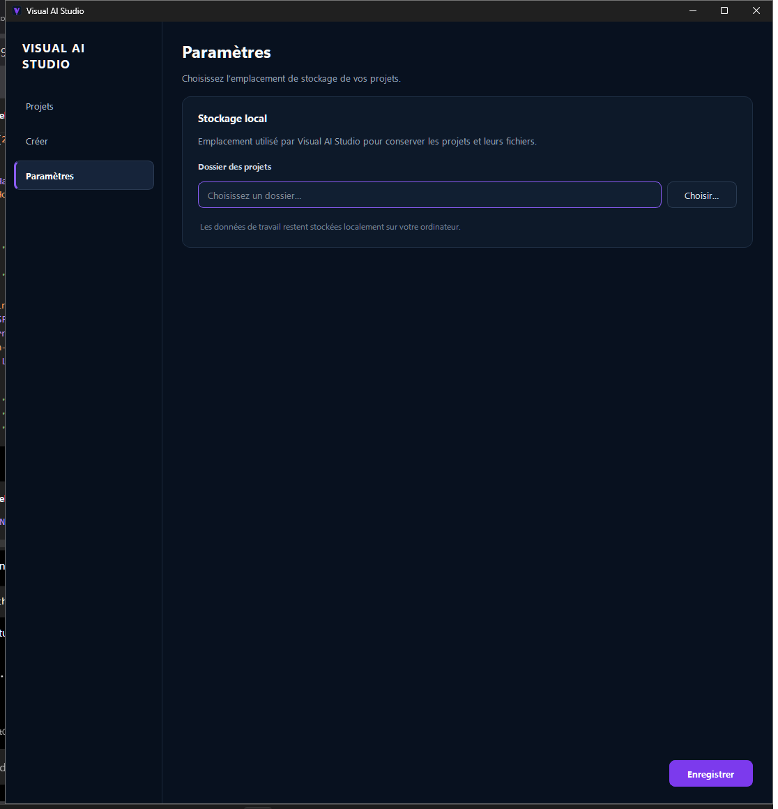

<p align="center">
  
</p>

<h1 align="center">Visual AI Studio</h1>

<p align="center">
  Studio Windows local pour structurer un brief, travailler avec Studio Visuel,
  contrôler les créations et exporter les livrables.
</p>

---

## À quoi sert Visual AI Studio ?

Visual AI Studio accompagne un projet visuel du brief jusqu'à l'export final.

L'application reste volontairement simple :

1. vous préparez le brief dans Visual AI Studio ;
2. l'application génère un prompt de lancement ;
3. vous copiez ce prompt dans Studio Visuel ;
4. Studio Visuel accompagne la création dans ChatGPT ;
5. vous récupérez les fichiers générés ;
6. Visual AI Studio les contrôle et les présente ;
7. vous validez puis exportez le résultat.

Visual AI Studio ne réalise **aucun appel direct à une API OpenAI** et ne nécessite aucune clé API OpenAI.

---

## Deux composants, deux rôles

### Visual AI Studio

L'application Windows prend en charge :

- les projets ;
- les briefs ;
- la préparation du prompt de lancement ;
- l'import des résultats ;
- la galerie de validation ;
- la validation humaine ;
- l'export local.

### Studio Visuel

Studio Visuel est l'agent conversationnel utilisé dans ChatGPT.

Il prend en charge notamment :

- la reformulation du brief ;
- la direction artistique ;
- le prompt image ;
- les contraintes négatives ;
- les contenus de publication ;
- la génération visuelle ;
- la livraison des résultats.

Le Skill `visual-content-studio` constitue la source de vérité fonctionnelle de l'agent.

Son package est fourni dans :

`agent/studio-visuel-agent.zip`

---

## Workflow



Le passage entre l'application et Studio Visuel reste manuel.

Ce fonctionnement évite d'imposer une API et permet à l'utilisateur de garder la maîtrise de chaque étape.

---

## 1. Les projets



La page **Projets** constitue le point d'entrée de l'application.

Trois statuts métier sont utilisés :

- **Brief**
- **Validé**
- **Archivé**

Les projets peuvent être retrouvés, ouverts et suivis depuis cette vue.

---

## 2. Créer un brief



La page **Créer** permet de structurer la demande visuelle avant de passer dans Studio Visuel.

Trois modes de sortie sont disponibles :

- **Pinterest**
- **Instagram**
- **Autre / personnalisé**

Le brief peut notamment préciser :

- le nom du projet ;
- la collection ou campagne ;
- l'idée ou la demande ;
- l'audience ;
- le style ;
- le texte souhaité dans l'image ;
- les dimensions ;
- le ratio ;
- les contraintes créatives ;
- les éléments obligatoires ;
- les éléments interdits.

Une fois le brief prêt, utilisez :

**Préparer pour Studio Visuel**

---

## 3. Préparer Studio Visuel



Visual AI Studio transforme le brief en **prompt de lancement**.

Ce prompt ne remplace pas le Skill de Studio Visuel.

Il transmet le contexte du projet et demande à Studio Visuel de démarrer son workflow conversationnel à partir du brief.

L'utilisateur peut alors :

1. copier le prompt ;
2. ouvrir Studio Visuel ;
3. coller le prompt dans ChatGPT ;
4. suivre les étapes de l'agent ;
5. valider chaque étape avant de poursuivre.

Studio Visuel commence par le brief et attend la validation de l'utilisateur avant de poursuivre vers la direction artistique puis la génération.

---

## 4. Importer et contrôler les résultats



Une fois les créations terminées dans Studio Visuel, les fichiers produits peuvent être importés dans Visual AI Studio.

L'application peut notamment gérer :

### Images

- PNG
- JPG / JPEG
- WebP

### Fichiers complémentaires

- Markdown
- TXT
- JSON

Les images sont présentées sous forme de galerie afin de pouvoir contrôler plusieurs créations dans un même projet.

Les éventuels avertissements sont affichés avant validation.

La validation finale reste volontairement humaine :

**Je valide ce résultat**

---

## 5. Exporter

Lorsqu'un résultat est validé, le projet peut être exporté localement.

Visual AI Studio crée un dossier d'export dédié au projet contenant les livrables disponibles.

Les données de travail restent locales sur l'ordinateur.

---

## 6. Paramètres



Les paramètres visibles restent volontairement réduits.

L'utilisateur choisit principalement le dossier dans lequel Visual AI Studio conserve ses projets et leurs fichiers.

Aucun compte cloud n'est requis par l'application.

---

## Installation Windows

Visual AI Studio est distribué sous forme d'application Windows autonome.

La distribution publique utilisera un installateur de la forme :

`Visual-AI-Studio-Setup-x.y.z.exe`

L'utilisateur final n'a pas besoin d'installer Python, Git ou Docker.

L'installation crée l'application Windows ainsi qu'un raccourci dans le menu Démarrer.

Un raccourci Bureau peut également être créé depuis l'installateur.

La première version publique sera distribuée via **GitHub Releases**.

---

## Installer Studio Visuel

Visual AI Studio et Studio Visuel sont distribués séparément.

Le package de l'agent se trouve dans :

`agent/studio-visuel-agent.zip`

Il contient les instructions de Studio Visuel ainsi que le Skill `visual-content-studio`.

Une documentation complémentaire est disponible dans :

[`agent/README.md`](agent/README.md)

---

## Stockage local

Visual AI Studio suit une approche **local-first**.

Les projets, la base de données et les fichiers de travail restent stockés localement.

Le dossier des projets peut être choisi depuis :

**Paramètres → Stockage local → Dossier des projets**

---

## Architecture technique

L'application repose notamment sur :

- Python 3.11+
- PySide6
- Pydantic
- SQLAlchemy
- SQLite
- Pillow
- platformdirs
- keyring
- PyInstaller
- Inno Setup

---

## Développement

### Installation

```powershell
git clone https://github.com/Etorrent-Org/visual-ai-studio.git
cd visual-ai-studio

py -3.11 -m venv .venv
.\.venv\Scripts\python.exe -m pip install -e ".[dev]"
```

### Lancement

```powershell
.\.venv\Scripts\python.exe -m visual_ai_studio.main
```

### Tests

```powershell
.\.venv\Scripts\python.exe -m pytest -q
```

---

## Structure du dépôt

```text
visual-ai-studio/
├── agent/
│   ├── README.md
│   └── studio-visuel-agent.zip
├── docs/
│   └── images/
├── installer/
├── migrations/
├── scripts/
├── src/
│   └── visual_ai_studio/
├── tests/
├── README.md
└── pyproject.toml
```

---

## Distribution

Les builds intermédiaires et les exécutables générés ne sont pas conservés dans Git.

Les installateurs officiels sont destinés à être publiés dans **GitHub Releases** avec leur empreinte SHA-256.

---

## Sécurité et confidentialité

Visual AI Studio ne nécessite aucune clé API OpenAI.

Les données restent locales sauf action volontaire de l'utilisateur en dehors de l'application.

Pour le signalement d'une vulnérabilité ou les règles de sécurité du projet :

[`SECURITY.md`](SECURITY.md)

---

## Version

Version de travail actuelle : **0.1.0**

La première distribution publique Windows est en préparation.

---

<p align="center">
  <strong>Visual AI Studio</strong><br>
  Du brief à la création, avec une validation humaine aux étapes essentielles.
</p>